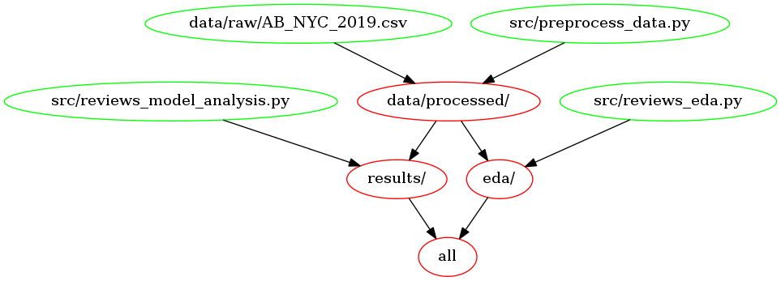

# Airbnb Reviews per Month Regression

Contributors: Lauren Zung

A mini project completed during the Fall 2022 session of DSCI 573 (Feature and Model Selection).

## Results

For this regression problem, I chose to optimize $R^2$ score to determine the best model to predict the reviews per month of Airbnb listings. On the test set of 19421 samples, the best model `LGBMRegressor` returned a score of 0.355. I have also computed a root mean squared error of 1.392, therefore the model predictions are approximately off by 1.392 reviews per month.

||Score|
|-|----|
|Train $R^2$|0.439|
|Train RMSE|1.223|
|Test $R^2$|0.349|
|Test RMSE|1.392|

## Usage

To replicate this analysis, you will first need to clone the repo.  You can do so with the following command line (terminal) commands.

```bash
# clone the repo
git clone https://github.com/lzung/airbnb_reviews.git

# change working directory to the root of the repository
cd airbnb_reviews
```

First, create and activate the required virtual environment with conda at the command line as follows:

```bash
conda env create -f environment.yaml
conda activate airbnb_reviews
```

Then, run the following command at the command line (terminal) to reset the repository to a clean state, with no intermediate or results files:


```bash
make clean
```

Finally, run the following command to replicate the analysis:

```bash
make all
```

## Makefile Dependency Diagram

